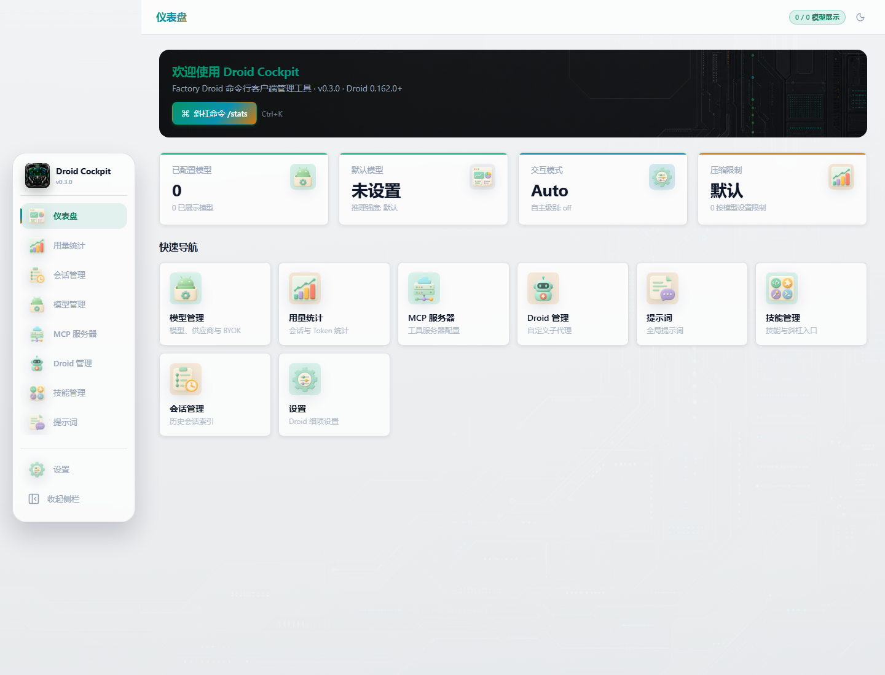
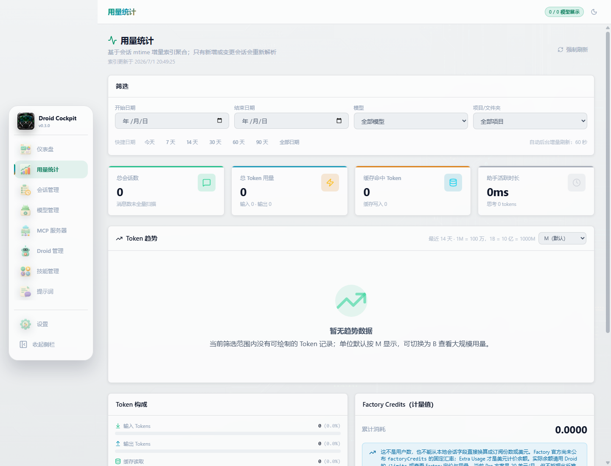
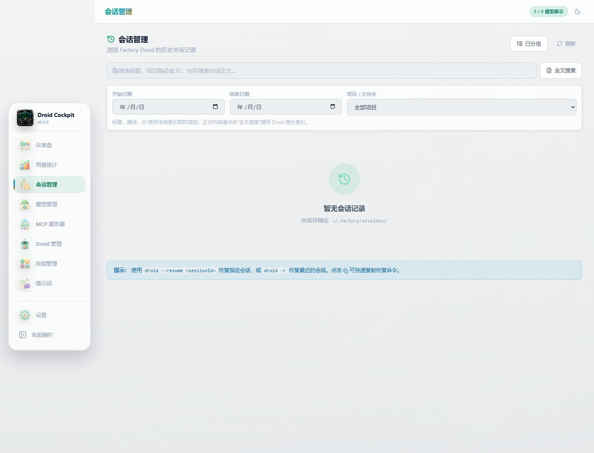
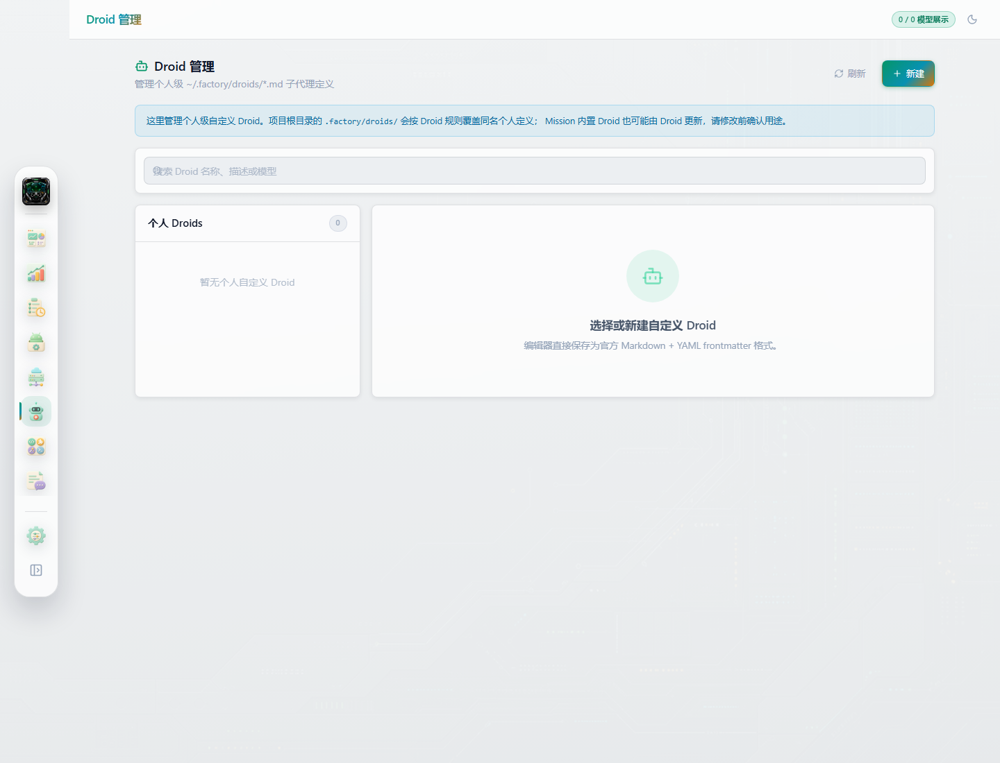
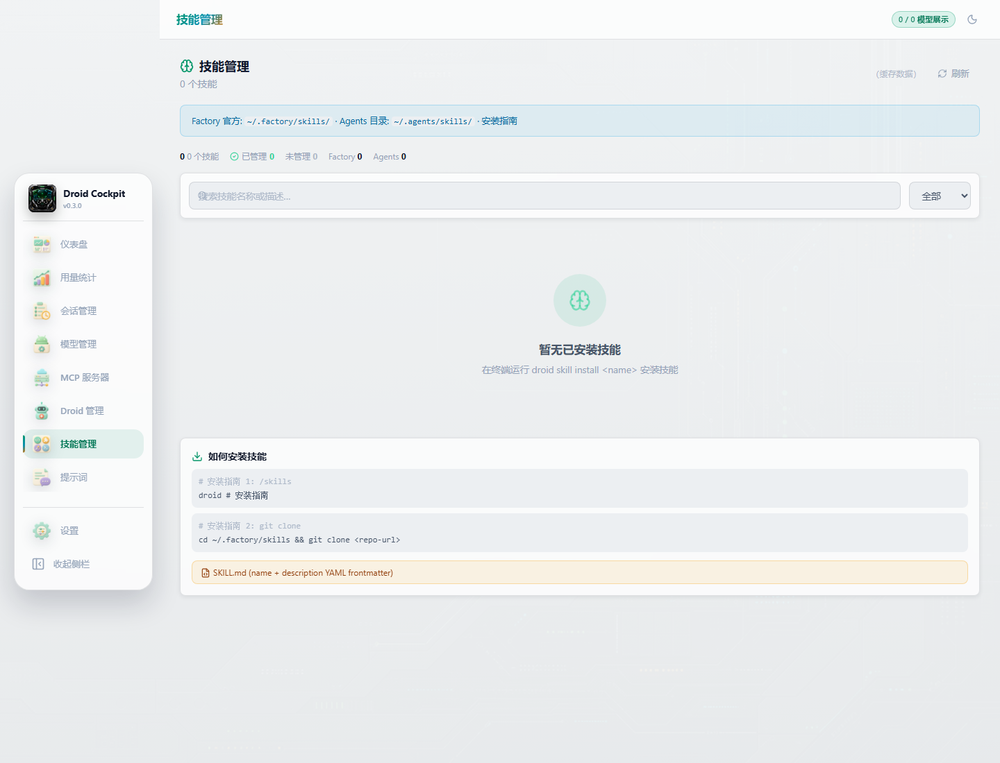
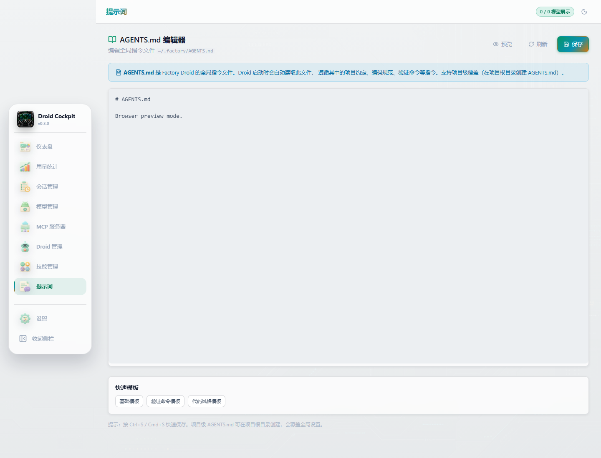
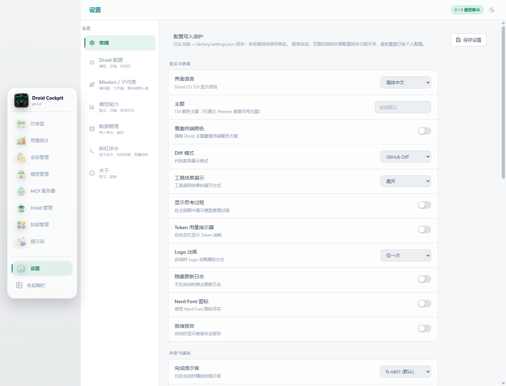
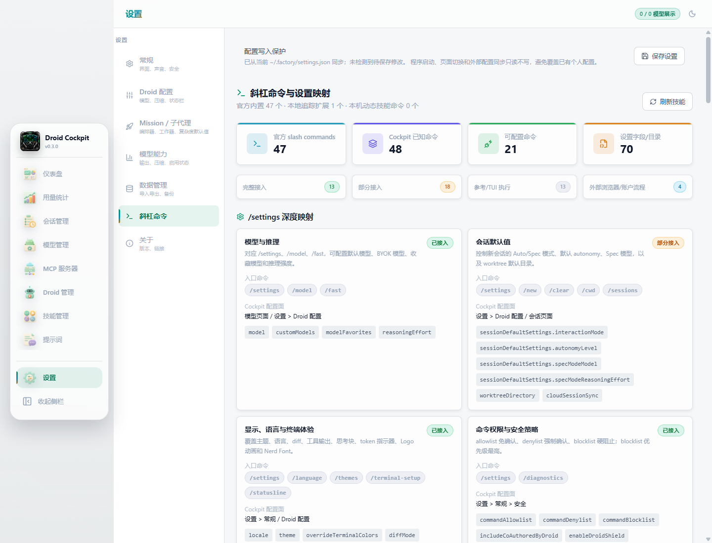

# Droid Cockpit

Droid Cockpit 是一个面向 Factory Droid CLI 的第三方 Windows 桌面管理面板。它不替代 Droid，也不随安装包分发 Droid CLI；它只把本机 `%USERPROFILE%\.factory\` 下的配置、模型、MCP、技能、Droid 子代理、提示词、会话和用量数据整理成可审阅、可备份、可恢复的 Tauri 应用。

界面默认使用中文。应用按 Factory 公开文档兼容 `settings.json`、BYOK 自定义模型和斜杠命令相关配置，并尽量保留未知字段，避免破坏未来版本或手动写入的配置。

## 当前状态

- 应用版本：`1.0.0`
- 目标系统：Windows 10 / Windows 11
- 技术栈：Tauri 2 + React 19 + TypeScript + Rust
- Node.js：`22` 或更高版本
- 包管理器：pnpm `11.7.0`
- Droid CLI：需要用户自行安装并登录
- 版本检查包：[`droid`](https://www.npmjs.com/package/droid)

## 界面截图

以下截图来自浏览器预览模式，优先使用空白或模拟状态。浏览器预览不会读取真实 Tauri 数据，因此不会展示真实 API Key、真实会话正文或个人配置内容。

### 仪表盘



### 模型管理


### 用量统计



### 会话管理



### MCP 服务器


### Droid 管理



### 技能管理



### 提示词



### 常规设置



### 斜杠命令设置



## AI 生成板块图标

项目使用 AI 生成的浅色 3D 风格小图标作为各板块入口图标，形式参考外卖平台常见的分类入口，但内容对应 Droid Cockpit 的实际功能板块。

已接入的透明 PNG 图标：

- `src/assets/generated/section-icons/dashboard.png`：仪表盘
- `src/assets/generated/section-icons/usage.png`：用量统计
- `src/assets/generated/section-icons/sessions.png`：会话管理
- `src/assets/generated/section-icons/models.png`：模型管理
- `src/assets/generated/section-icons/mcp.png`：MCP 服务器
- `src/assets/generated/section-icons/droids.png`：Droid 管理
- `src/assets/generated/section-icons/skills.png`：技能管理
- `src/assets/generated/section-icons/prompts.png`：提示词
- `src/assets/generated/section-icons/settings.png`：设置

## 管理范围

Droid Cockpit 主要读取或写入以下本地内容：

- `%USERPROFILE%\.factory\settings.json`
- `%USERPROFILE%\.factory\mcp.json`
- `%USERPROFILE%\.factory\cockpit-models.json`
- `%USERPROFILE%\.factory\skills\`
- `%USERPROFILE%\.agents\skills\`
- `%USERPROFILE%\.factory\droids\`
- `%USERPROFILE%\.factory\sessions\`
- `%USERPROFILE%\.factory\AGENTS.md`

启动、切换页面和自动同步只读不写。用户点击保存、导入、恢复、卸载技能或编辑 Droid/提示词时，应用才会写入对应文件。写入 `settings.json`、`mcp.json` 和 `cockpit-models.json` 前会创建版本化备份。

## 斜杠命令

`设置 > 斜杠命令` 页面把 Droid 官方内置斜杠命令和 Cockpit 可配置项做了映射，重点覆盖：

- 模型与推理：`/settings`、`/model`、`/fast`
- 会话默认值：`/new`、`/clear`、`/cwd`、`/sessions`
- 显示与语言：`/themes`、`/language`、`/statusline`、`/terminal-setup`
- 命令权限与安全：allowlist、denylist、blocklist、Droid Shield、后台进程
- Hooks：`/hooks`、hook 输出、hooks 配置引用
- Mission 与子代理：`/missions`、`/droids`、worker、validator、orchestrator 设置
- 上下文与用量：`/context`、`/compress`、`/limits`、`/cost`、`/stats`
- 扩展：`/skills`、`/commands`、`/plugins`、`/mcp`、`/create-skill`

## 核心功能

- 管理 Droid `settings.json`，保留未知字段和当前官方顶层字段。
- 管理 BYOK 自定义模型，只把 Droid 支持字段写入 `customModels`，应用私有字段保存在 `cockpit-models.json`。
- 管理 MCP、技能、自定义 Droid、全局 `AGENTS.md` 提示词。
- 浏览会话与用量统计，索引只记录必要元数据，不把绝对路径暴露给前端持久化结果。
- `Ctrl+K` 命令面板可查询官方 slash commands，并打开 `/stats` 统计视图。
- 启动时可静默检测 Droid 版本；关闭自动检测后只读取本地版本。
- 支持脱敏导出、完整导出、完整备份、恢复和导入。

## 安全模型

- 默认不覆盖用户配置；只有明确操作才写入。
- 备份保存在 `%USERPROFILE%\.factory\cockpit-backups\`，恢复采用校验和回滚策略。
- 脱敏导出会隐藏 API Key、Token、Authorization、密码、私钥、环境变量和请求头。
- 测试自定义模型连接时，Cockpit 不读取 `${ENV_VAR}` 环境变量引用；该引用可以保存给 Droid CLI 在实际运行时解析。
- 模型连接测试只允许公开 HTTPS Endpoint 或本机回环地址，禁止私网、链路本地、元数据地址和自动重定向。
- Windows 子进程使用无控制台窗口方式启动，避免启动或搜索时闪出命令行窗口。
- 应用启用单实例，避免多个窗口同时写同一份本地配置。
- `settings.local.json`、`.env`、私钥、签名证书、安装包和本地审计文件默认被 Git 忽略。

## 本地开发

```powershell
corepack enable
pnpm install
pnpm dev
```

Tauri 开发：

```powershell
pnpm tauri dev
```

检查版本号和前端构建：

```powershell
pnpm check
```

Rust 检查与测试：

```powershell
cd src-tauri
cargo check
cargo test
```

截图直达参数：

```text
http://localhost:1420/?page=dashboard
http://localhost:1420/?page=settings&tab=slash-commands
```

支持的 `page`：`dashboard`、`models`、`skills`、`droids`、`prompts`、`sessions`、`mcp`、`usage`、`settings`。

支持的设置 `tab`：`general`、`droid-config`、`mission`、`usage`、`data`、`slash-commands`、`about`。

## Windows 打包

```powershell
pnpm tauri build
```

当前配置只生成 NSIS 安装器，并使用当前用户安装模式。正式公开发布前建议配置代码签名证书；未签名安装器可能触发 Windows SmartScreen 提示。

## 发布

首版只发布 Windows x64 安装器：

```text
Droid Cockpit_1.0.0_x64-setup.exe
```

发布前应确认：

- `pnpm build` 通过
- `cargo test --locked` 通过
- `pnpm tauri build` 通过
- GitHub Release 只上传 Windows 安装器，不上传 `target/`、`dist/`、`.pdb`、本地配置或旧版本安装器

完整发布说明见 `RELEASE_NOTES.md`。

## 项目结构

```text
src/
  assets/generated/  AI 生成位图资源
  components/        React 页面和通用组件
  config/            应用常量、模型预设、斜杠命令目录
  i18n/              中文和英文语言包
  stores/            Zustand 状态与配置归一化
  utils/             Tauri invoke 封装、缓存、版本检查
src-tauri/
  src/               Rust 命令、原子写入、会话索引
  icons/             Windows 应用图标
docs/screenshots/    无敏感信息的界面截图
```

## 官方参考

- [Droid CLI reference](https://docs.factory.ai/reference/cli-reference)
- [Droid settings](https://docs.factory.ai/cli/configuration/settings)
- [BYOK overview](https://docs.factory.ai/cli/byok/overview)
- [Skills](https://docs.factory.ai/cli/configuration/skills)
- [Custom slash commands](https://docs.factory.ai/cli/configuration/custom-slash-commands)
- [Plugins](https://docs.factory.ai/cli/configuration/plugins)
- [Release notes](https://docs.factory.ai/changelog/release-notes)

## 许可证

MIT。Droid、Factory、相关文档与服务归其各自权利人所有。
